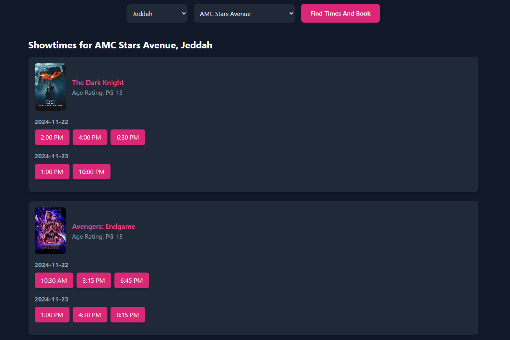
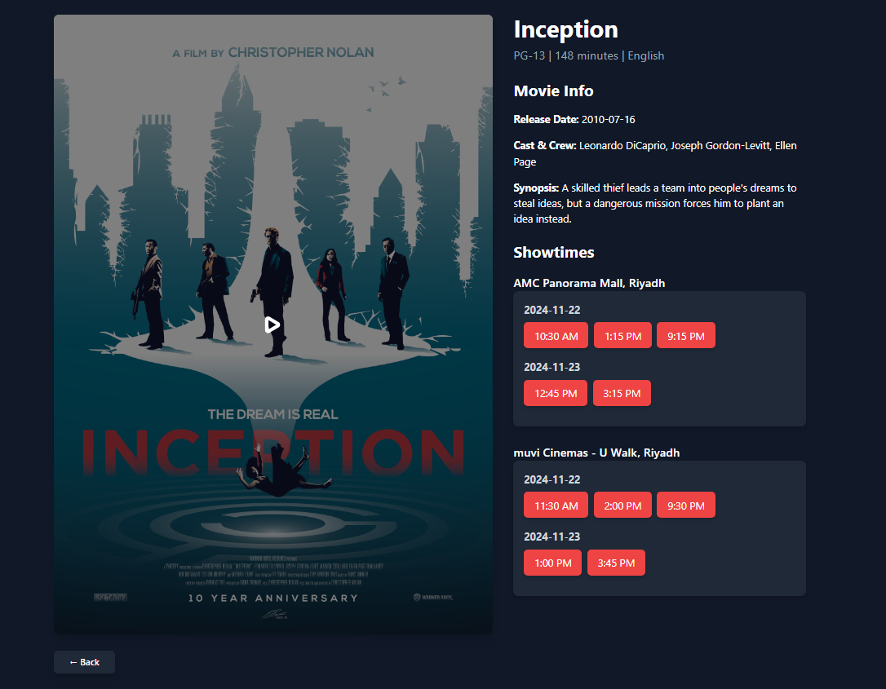
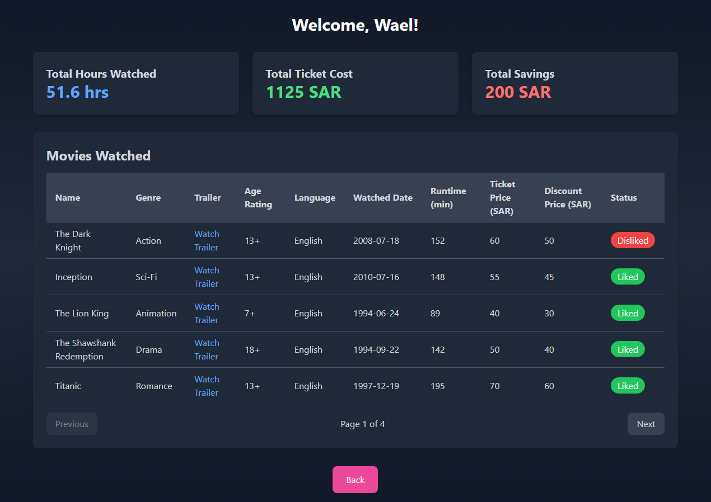

# Aflam: Centralized Cinema Experience

**Aflam** is a cutting-edge platform designed to revolutionize the moviegoing experience in Saudi Arabia. By integrating multiple cinema chains such as **Muvi**, **AMC**, **Vox**, and more, Aflam offers a seamless way to view, compare, and book movies—all in one place.

## Features

### AI-Driven Innovations
- **AI-Powered Movie Recommendations**: 
  - Personalized suggestions tailored to individual preferences.
  - Mood-based recommendations to match your current emotional state.
- **Movie Poster Recognition**: 
  - Instantly discover showtimes and booking options by capturing a photo of any movie poster.

### Benefits
- Unified platform for all major cinemas.
- Advanced filtering options to make movie selection easy and intuitive.
- Modern, user-friendly design focused on delivering a seamless experience.

## Development Approach

Aflam will be developed using the **Agile methodology** to ensure:
- Flexibility in responding to user feedback.
- Iterative improvements for a high-quality product.
- Efficient collaboration among development teams.

Stay tuned for more updates as Aflam transforms the way you enjoy movies!

## Build Instructions

### Prerequisites
Before you start, make sure you have the following installed on your system:
- [Node.js](https://nodejs.org/) (version 14 or above)
- [npm](https://www.npmjs.com/) (npm comes bundled with Node.js)

### Cloning the Repository
1. Clone the project repository:
   `git clone https://github.com/Waelhab/loremipsum.git`

2. Navigate to the project directory:
    `cd loremipsum`

3. Install Vite:
    `npm install vite`

4. Start the server:
    `npm run dev`

# UI

The following is a guide on the interface of our React application, to help you better understand what is currently available in this version.

## Login Page

## Home Page

## Filter By City

## Movie Details

## User History

